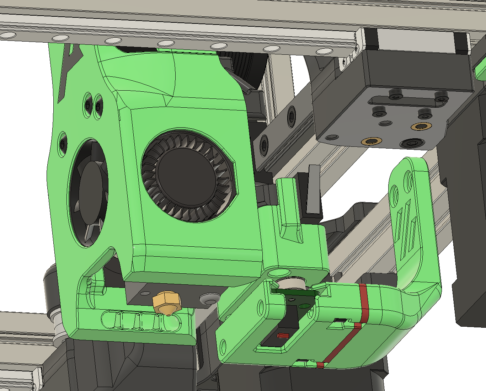
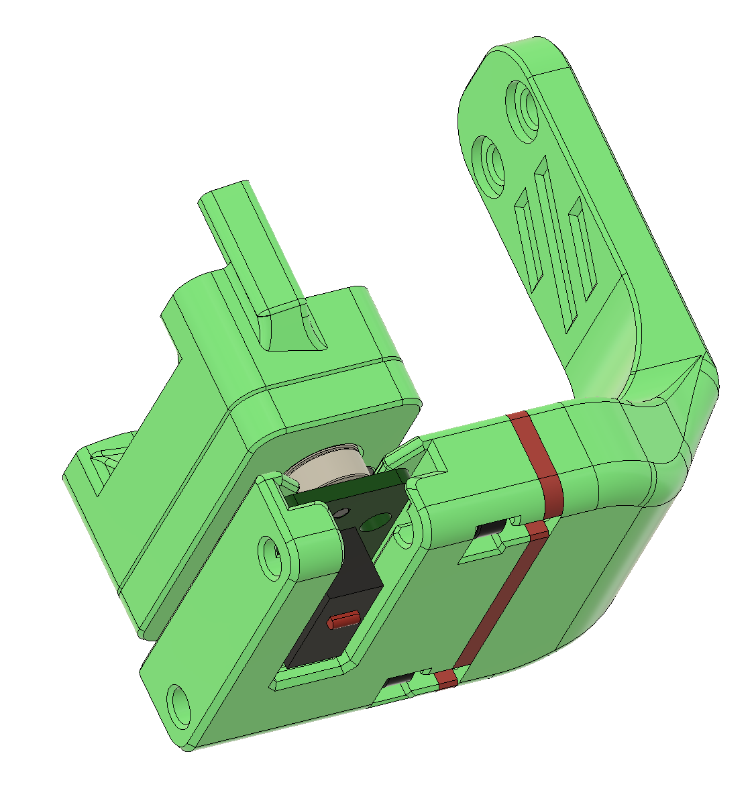
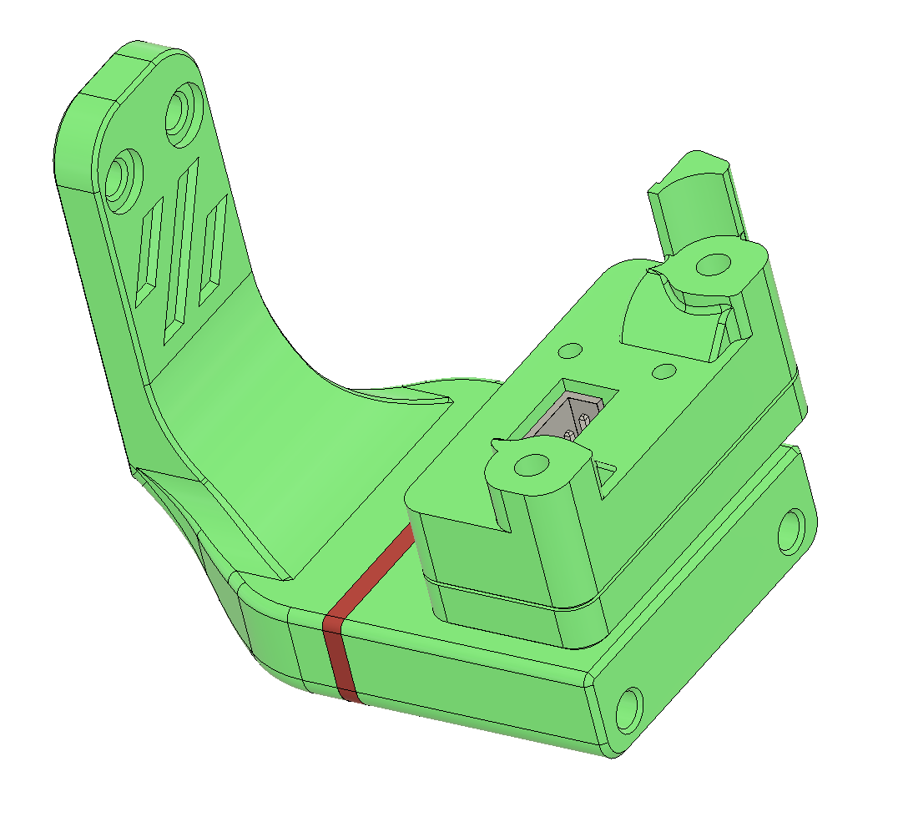
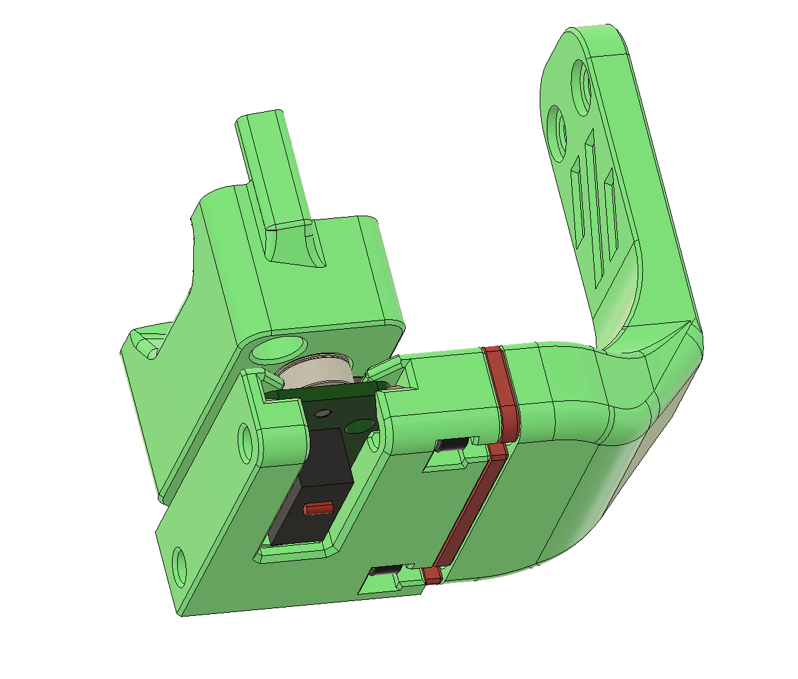

# Euclid mount for Micron

You can use the same script as Klicky probe. 
There is section in the Klicky macro for Euclid, woks w/o any issues.
To catch the Euclid probe, you just need to approach the dock from the front.
To release the probe, you approach the dock from the side and release going forwards.

All STL' on Printables, link in the STL folder.

Gantry dock mount is the same, probe dock and X carriage mount is new design.
I've created 1 and 2mm spacers between dock and gantry mount, I did not need it for my 120mm build

Screws to mount the Dock to the Gantry mount:
2x M3x6-10 dependend on spacers you use.

